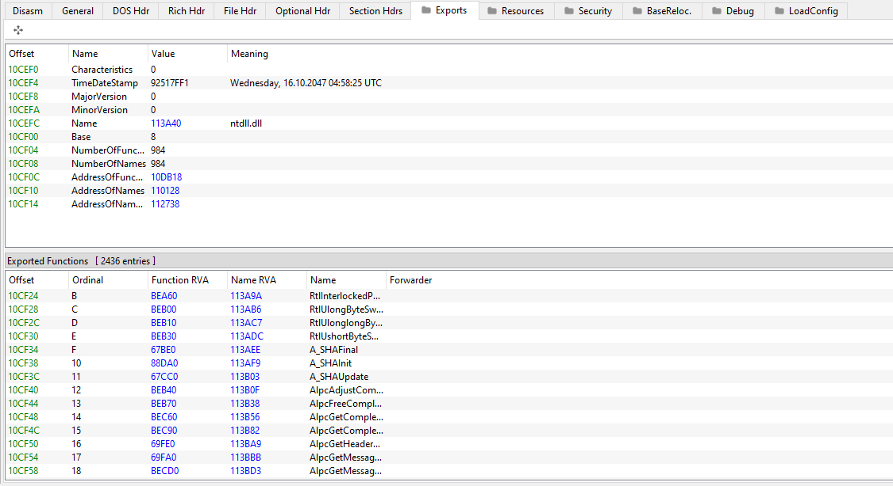

# **ROOTKIT LOADER**

## **SUMMARY**

The goal here is to obfuscate exported API functions using hand-made api hashing obfuscation, the rootkit driver will be loaded using SCM technique

---

- `RtlGetCurrentPeb` get [Thread Environment Block](https://learn.microsoft.com/en-us/windows/win32/api/winternl/ns-winternl-teb) process structure, by calling [`NtCurrentTeb`](https://learn.microsoft.com/en-us/windows/win32/api/winnt/nf-winnt-ntcurrentteb) in this structure you can found a pointer to the [Process Environement Bloc](https://learn.microsoft.com/en-us/windows/win32/api/winternl/ns-winternl-peb), this is the main structure of this project, which will be used in SelfGetModuleHandle

- `SelfGetModuleHandle` does the same as [GetModuleHandleA](https://learn.microsoft.com/en-us/windows/win32/api/libloaderapi/nf-libloaderapi-getmodulehandlea), I made this function, first because its interesting to do it, but the SelfGetModuleHandle will allow me to call dll functions without any exports.

After getting a pointer to a PEB_LDR_DATA structure that contains information about the loaded modules for the process, I go through each loaded module of the executable, the main goal here is to get the DLLBase, if i have the DLLBASe, i can just add function offset and get the address of the function to call.
The LIST_ENTRY structure help to go through each, the pointer `Flink` is a pointer to the next entry, and the `Blink` does the same but backwards, and the end, the `Flink` is a pointer to the start of the start of the structure
By going through this structure, i check everytime 

For more stealth, i used a [MD5 implementation](https://github.com/Zunawe) in c, because i don't want to define strings in.

- `SelfGetProcAddress` does the same thing as [GetProcAddress](https://learn.microsoft.com/en-us/windows/win32/api/libloaderapi/nf-libloaderapi-getprocaddress), once located and got the base of the loaded dll, the main will be to locate the target function in the DLL, a DLL have a export table, this table contains all the functions exported by this DLL, for example the export table of the NTDLL looks like this

`SelfGetProcAddress` go throught the export table and check the name of each function, if found, it use the ordinal for locate the associated function offset, the target function is just the address of the base+offset

---

- `main` contains the code to load data stored in the resource section into memory, for later use, the rootkit will be hidden in a legit stored data, like a image, i used the winapi with the previous obfuscation, for the main loader, i used a technique wich i can use **paged pool memory section**, for later and more serious use, maybe use a non-conventional technique, for now, SCM is engouth.(you have to load the driver with the testsign option enabled)

*for any questions/errors plz dm me Prince 2 lu#9030*