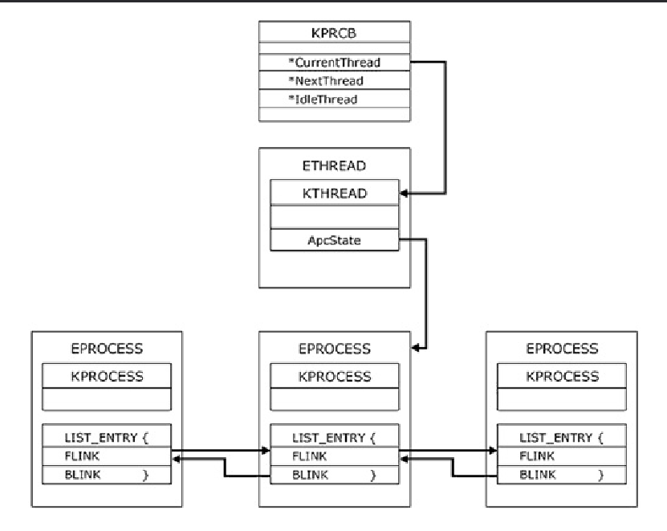
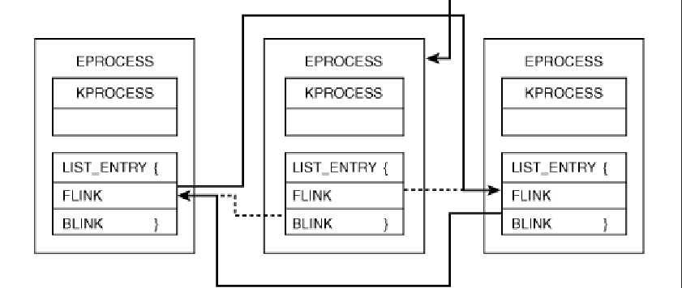
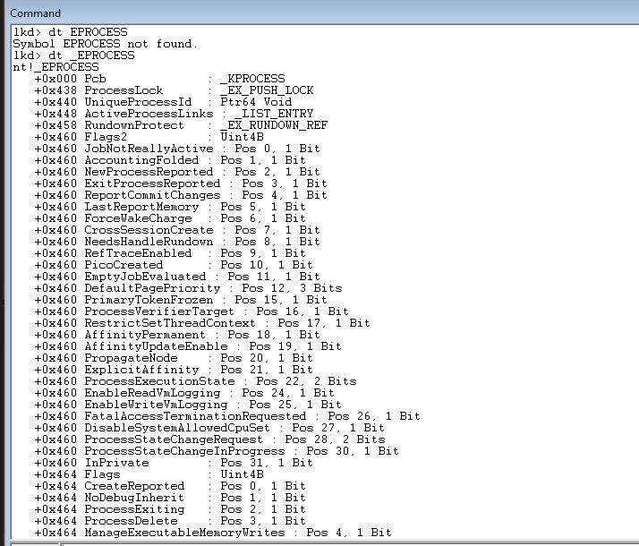

# **ROOTKIT LOADER**

## **SUMMARY**

This driver looks more like a playground for kernel programming than a concrete project, but theres interesting stuff. Lot of elements are still in dev, this project is not finished

---

- `HideProcess` get the EPROCESS structure of a target PID using `PsLookupProcessByProcessId` (this can be made manually pretty easily), EPROCESS is a opaque structure and the basis of the process hiding

To hide this process, you just have to create a bridge betwee previous EPROCESS and the next EPROCESS

*ex:*

---

- `ElevateSpecificPID` locate the token in the EPROCESS structure of SYSTEM (PID of system is always 4), but the driver is loaded using SCM, accordingly System has loaded the driver, and you can just retrive the EPROCESS using PsGetCurrentProcess, the function just copy the token of System, and paste it in the same offset in the EPROCESS structure of the target PID, the pid has now the NT user privilege.

- `SearchAndRemoveEPROCESSbyOffset` EPROCESS contains the name of the curent process (with characters limitations),the function go through all the EPROCESS structures of windows, and when the name is the good one, just get the PID (offset 0x440), and use the previous function `HideProcess`. I found that the PEB is located in the EPROCESS structure, for more stealth, istead of check with the process name, i can just add a very specific data in the very bottom and unknow section of the PEB, and make this function check in the PEB instead of the name, for now, i'll just check the name

*the EPROCESS structure and the offsets*

- `HideDriverSection` Is very specific and locate the [LDR_DATA_TABLE_ENTRY](https://learn.microsoft.com/en-us/windows/win32/api/winternl/ns-winternl-peb_ldr_data) of the current driver, the hiding work the same as HideProcess. If you have recommandation about it, contact me.

**All the functions about SSDT aren't finished and i'm still working on it, i'm trying to make SSDT hooks, now the ssdt is protected by patchguard.**

*contact (discord): Prince 2 lu#9030*